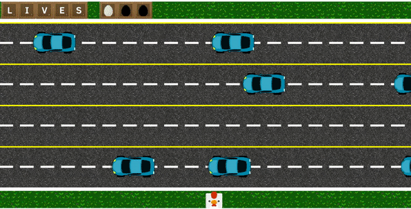

"Why did the chicken cross the road?" was my first project from the Iron Hack Bootcamp of web development during one week with Pedro Conde.

*To get to the other side*

This was my first approach to game development and for this reason I choose a frogger-like game because it is only necessary considerate the trajectories of obstacles along one axis. This reduces the complexity of the movements. I used a 2D environment for simplicity and because is one of the project conditions.

One of the principal problems I found was the graphic design and creation. The game has an aerial 2D perspective and mostly of the sprites of chickens for animate that I found had a lateral 2D perspective. I used as solution a simply and handmade animation of bouncing, using a static picture and the free software [piskel](https://www.piskelapp.com/). I can change the chicken image, but the title's pun will be lost.

<figure style="text-align: center">
     
    <figcaption>Gameplay example.</figcaption>
</figure>

How the game has a simple mechanic, without jumps and lines of obstacles, I added other elements, like a two local multiplayer mode. Also, you can choose the character and their controls. A difficult selector was planned, but the testing phase was longer than expected and this can't be implemented for the lack of time but the game was designed with the idea that the number of lines of obstacles and their velocity can be changed.

Other feature of the game is the music. The game has music as background loop, sound effect and victory and game over music. Also, the game has different win screens, that varies with the character and the number of players.

The game is online and you can [play for free](https://amanda-oc8.github.io/Why-did-the-chicken-cross-the-road/). You also can check the code on my [github page](https://github.com/Amanda-OC8/Why-did-the-chicken-cross-the-road). Although it was a small and simple project, I'm very proud of the result of my first approach on the game design and the we development.

###### Technologies: Canvas2D, HTML5, CSS3, JS