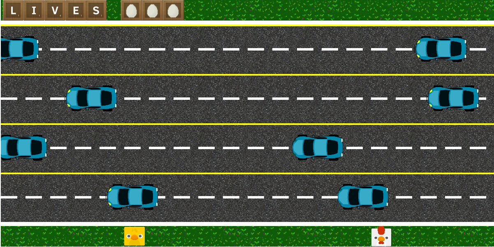

"Why did the chicken cross the road?" was my first project in web development during one week with Pedro Conde.

*To get to the other side*

This was my first approach to game development and for these reason I choose a frogger-like game. I only need to determinate the colission create a random line of obstacles.
One of the problems I found is the the graphic part. The game have an aerial 2D perspective and mostly of the sprites I found of chickens are lateral 2D perspective. Finally I made a simple bouncing animation using an image and piskel to make the effect. I can changed the chicken image, but the title pun will lost.

<figure style="text-align: center">
     
    <figcaption>Gameplay example.</figcaption>
</figure>

The game has different features as the two local player cooperative mode. You can choose at start if you want to play one or two player, and choose the chick or the chicken to try to cross. A difficult selector has planned but I not have had enough testing time to implement. The game has different finals that change with the player.

The game is online and you can [play for free](https://amanda-oc8.github.io/Why-did-the-chicken-cross-the-road/). You also can check the code on my [github page](https://github.com/Amanda-OC8/Why-did-the-chicken-cross-the-road)

###### Technologies: Canvas2D, HTML5, CSS3, JS