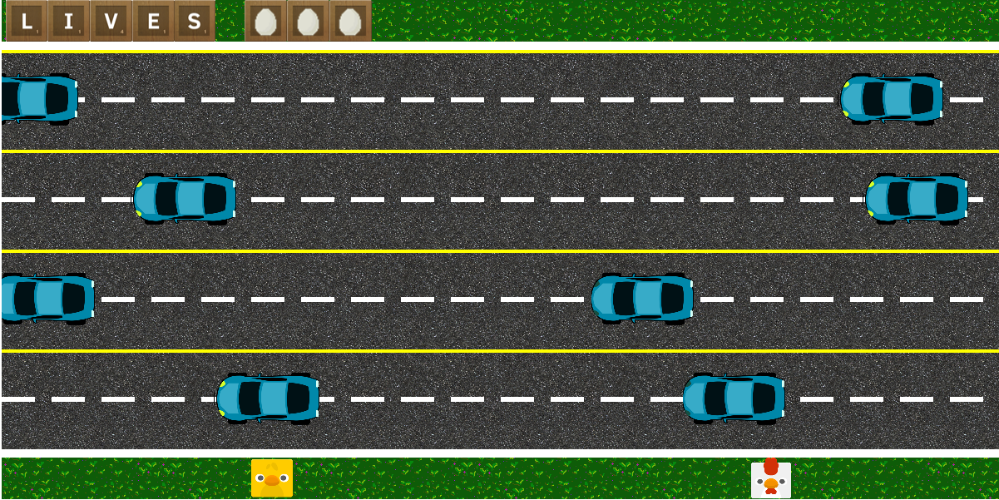
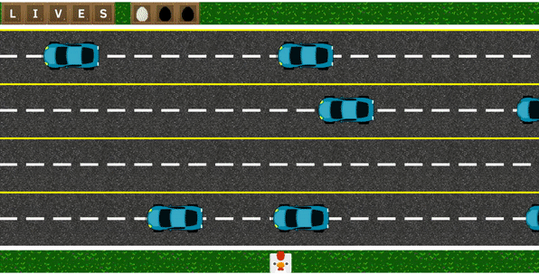

"Why did the chicken cross the road?" fue mi primer proyecto de desarrollo web junto con Pedro Conde.

*Para llegar al otro lado*

Fue mi primera aproximación al desarrollo web y de juegos así que por ese motivo escogí un juego tipo *frogger* ya que sólo había que considerar la colisión con una serie de obstaculos aleatorios. 

Uno de los problemas que encontré fue el apartado gráfico: el juego usa una cámara área, lo que limitaba el número de *sprites* que se podían usar. La mayoría de diseños que encontré eran de *sprites* en perspectiva 2D lateral, así que finalmente hice una animación sencilla de bote usando una imagen estática y la herramienta gratuita piskel. Hubiera sido más fácil cambiar el animal, pero se hubiera perdido la gracia de la pregunta de saber porqué el pollo cruzó la carretera. 

<figure style="text-align: center">
     
    <figcaption>Ejemplo de <i>gameplay</i></figcaption>
</figure>

Como el juego era mecánicamente sencillo (colisiones y movimientos en dos dimensiones, sin saltos) decidimos incluir distintos elementos, como un modo de dos jugadores en local, así como poder escoger si llevar un pollo o un pollito. Se planeó incluir un selector de dificultad, pero la fase de testeo llevó más tiempo del previsto y no se puedo implementar por falta de tiempo. Lo que sí se pudo incluir fueron distinto finales en caso de cruzar la carretera con éxito, variables según el número de jugadores y el personaje.

El juego también incluye música y efectos de sonido. Se puede probar de [forma gratuita](https://amanda-oc8.github.io/Why-did-the-chicken-cross-the-road/), además de consultar el código en mi [github](https://github.com/Amanda-OC8/Why-did-the-chicken-cross-the-road)

###### Tecnologías: Canvas2D, HTML5, CSS3, JS