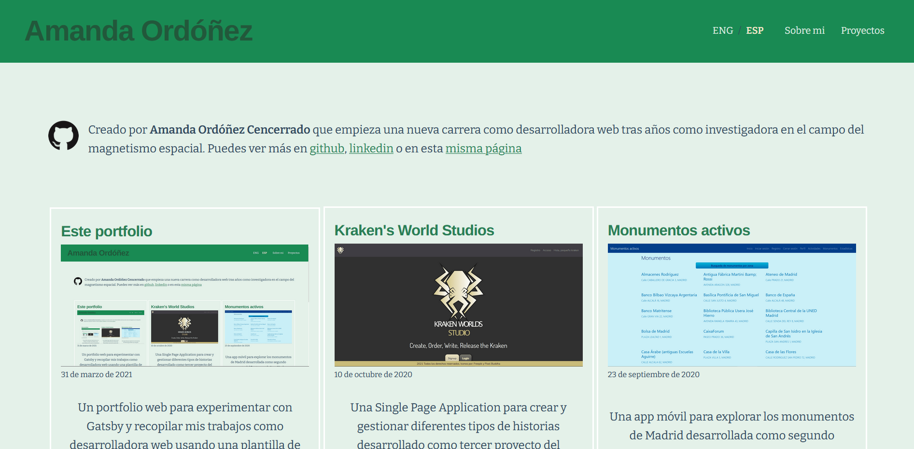

Este *portfolio* es otro proyecto. En un curso sobre React aprendí sobre Gatsby y quise probar por mi cuenta como funcionaba este *framework*. He usado como plantilla [Gatsby Starter Blog](https://www.gatsbyjs.com/starters/gatsbyjs/gatsby-starter-blog) para tener una base desde la que hacer el desarrollo de *front end*. Me gusta trabajar con una base ya hecha de la interfaz para poder centrarme en el desarrollo de otros elementos, como la parte interna o escoger una paleta de colores que no sea una combinación de blanco-negro para evitar el modo nocturno. Para esto último he usado la web de [coolors.co](https://coolors.co/) para tener una paleta limitada que se ajuste a lo que busco (sin grandes contrastes entre oscuro y claro y apto para daltónicos).

Escogí la plantilla de Gatsby Starter Blog frente a la elección lógica del portfolio dev ya que este usaba un CMS externo para crear los posts y yo ya había trabajado de esta forma en el curso que he mencionado. Esta plantilla en cambio trabaja usando Markdown, lo que me permitía experimentar nuevas tecnologías y aprender de ellas. He usado la plantilla del portfolio dev como guía para desarrollar este portfolio porque si algo funciona no lo arregles

*La página de inicio que muestra la página de inicio que muestra...*

Un elemento que quise añadir es un cambio de idioma, entre español e inglés. Por mis estudios y trabajo, estoy acostumbrada a escribir y trabajar en inglés, pero el castellano sigue siendo mi lengua materna y la que uso en mi día a día. Así que por eso decidí que el portfolio tendría para intercambiar entre ambos idiomas además de permitirme expertimentar como hacer un sitio web multilingüe.

Esto está implementado como un *state* que cambia entre dos idiomas. El *state* está reducido a *true* o *false* por ese motivo pero se podría aumentar el número de idiomas mediante posiciones de un *array*. Escogí usar el inglés y no el español como idioma predeterminado porque en desarrollo web es la lengua por defecto, incluido.

Para la página de inicio he seguido una distribución de tarjetas clásica, usando lo que venía en esta plantilla, y personalizando lo que se muestra desde el markdown. La entrada de cada página lleva un texto donde se explica las ideas tras el diseño y desarrollo de cada trabajo. El diseño *responsive* del menú no venía en la plantilla, así que lo desarrollé aparte, siendo el *toggle* menú del inicio lo más complejo, pero que acabé implementando de forma satisfactoria.

He encontrado dificultades en el desarrollo, como incompatibilidades entre mi sistema operativo y algunos plugins por lo que he tenido que sortear estos problemas con maña en la programación. Por lo demás, el trabajar con Markdown ha sido muy satisfactorio pues es una herramienta sencilla y muy potente que muestra que con poco se pueden lograr grandes cosas. Se pueden ver las tripas de este proyecto en mi [git-hub](https://github.com/Amanda-OC8/portfolio) y para visitarlo, sólo tienes que voler al [inicio](/).

###### Tencologías: Gatsby, Markdown, CSS3