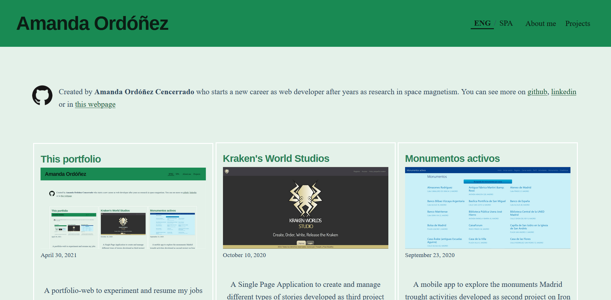

Este *portfolio* es otro proyecto. En un curso sobre React que realicé aprendí sobre Gatsby y quise probar por mi cuenta como funcionaba este *framework*. He usado como plantilla [Gatsby Starter Blog](https://www.gatsbyjs.com/starters/gatsbyjs/gatsby-starter-blog) para tener una base desde la que hacer el desarrollo de *front end*. Me gusta trabajar con librerias de este tipo como bootstrap, para no tener que estar haciendo los cálculos de los tamaños óptimos de márgenes, letras, etc. Esto me permite centrarme en el desarrollo de otros elementos, como escoger una paleta de colores acorde a mis gustos (que no sea una combinación de blanco-negro para evitar el modo nocturno). Para ello he usado la web de [coolors.co](coolors.co) para escoger una paleta limitada que se ajuste a lo que busco.

Escogí la plantilla de Gatsby Starter Blog frente a la plantilla de portfolio dev porque esta plantilla trabajaba usando un CMS externo y yo quería experimentar la tecnología de Markdown, que es la que aparecía definida en la otra. Si que me fijé en la estructura que sigue el portfolio dev para reproducirla aquí, porque si algo no está roto, no trates de arreglarlo.

*The home page with an image of the home page with an image...*

Un elemento que quise añadir es un cambio de idioma, entre español e inglés. Por mis estudios y trabajo, estoy acostumbrada a escribir y trabajar en inglés, pero en ocasiones echo de menos hacerlo en español. Así que por ese motivo decidí que el portfolio tendría para intercambiar entre ambos idiomas. Y también para experimentar como hacer un cambio de este tipo desde cero.

Para la página de inicio he seguido una distribución de cards clásica, usando lo que venía en esta plantilla, y personalizando lo que se muestra desde el markdown. La entrada de cada página lleva un texto donde se explica las ideas tras el diseño y desarrollo de cada trabajo. El diseño *responsive* del menú no venía en la plantilla, así que lo desarrollé aparte, siendo el *toggle* menú del inicio lo más complejo, pero que acabé implementando de forma satisfactoria.

Respecto al cambio de idioma, está implementado como un state que cambia entre dos idiomas. Si hubiera más, el cambio sería más complejo de realizar, pero se seguiría pudiendo centrarlizar desde el state, filtrando las llamadas desde graphql luego. Escogí usar el inglés y no el español como idioma predeterminado porque estoy más acostumbrada a mover en ambientes en inglés que en español y me resulta más natural.

###### Tencologías: Gatsby, Markdown