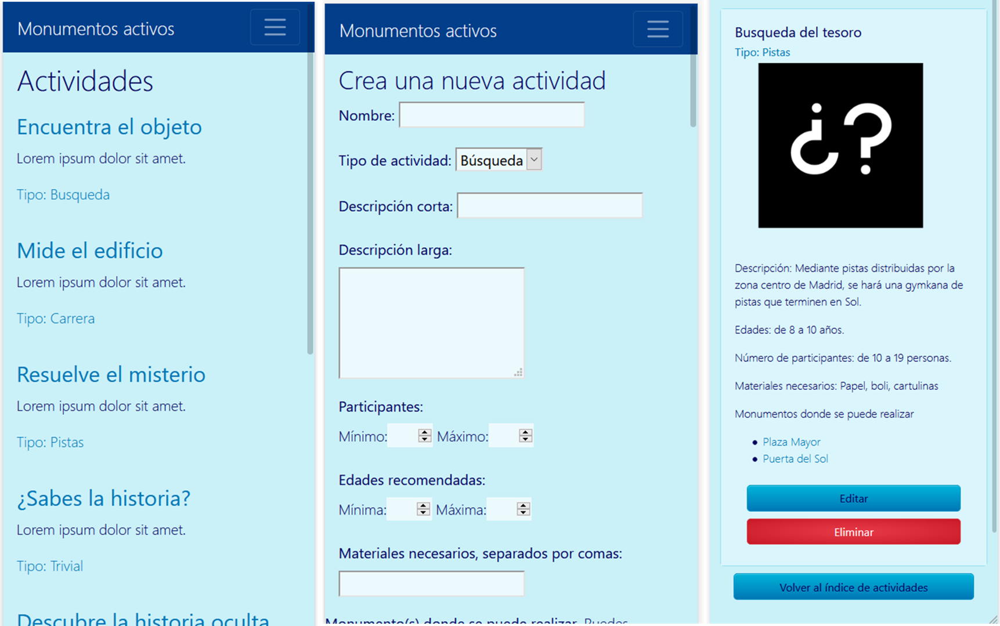
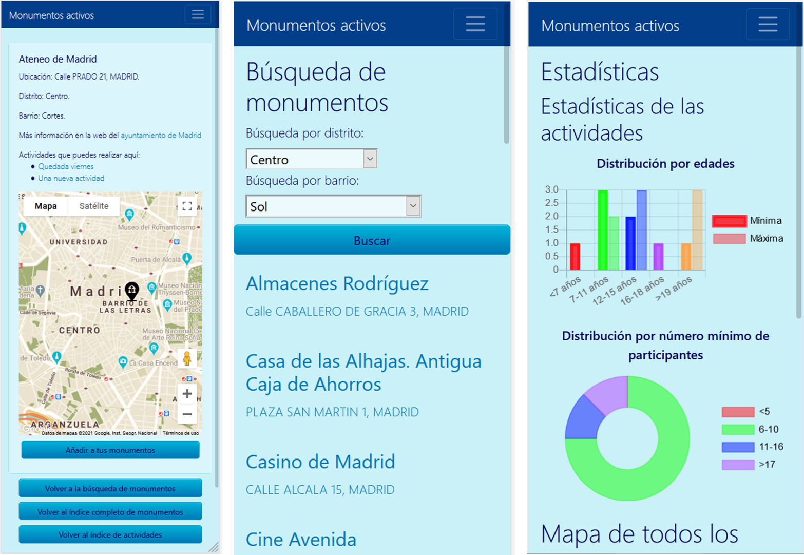

This is the second project from the Iron Hack Bootcamp. Initially designed as two person project, I made them alone because personal circumstances with my partner. For this project we have different conditions on their development such the use an external API. The project was centered on testing our abilities on the back-end at the same time that we continuous using our front-end abilities.

With these limitations, I searched in the open API's from Spain's government and discovered the database of the Madrid's town council. In this database I discovered an API with data from the monuments on the city of Madrid. This remembered me when I was a counselor at Scout's Group and make activities with the kids on the city of Alcalá de Henares, that have many historical sites to visit. I thought that it was possible to combine both ideas and create an app where you can have a list of places and a list of activities that you can make in there. Also, you know the age, number of participants, materials and type of activity possible for each place. With all of these, I created "Monumentos activos", a mobile app.

*Different activities' screens.*

The color scheme of the web was designed using [coolors.co](coolors.co/), a web for colors schemes. We choose the blue as color base and search a palette. The idea was using a color scheme that will be comfortable to the sight for the people that use the dark mode and the bight mode on web pages avoiding big contrasts with dark and light colors. Also, the web allows to previsualize the color combination for the different types of color blindness to improve the accessibility of the page. All the app is only available in spanish because was designed for the use of people with no dominion of the english.

The principal difficult with the App development was the data. The data from the Madrid's town council are not a rest API as I thought and the web page provides a json file with all the data. For this reason, the app load locally the data from an adapted json file for the manage of the data. But one of the project requirements is the use of an external API. For this reason, I searched for other API and I finally choose the Google Maps API, that allow locate each monument using the geographical coordinates that appear in the json file.

The back-end part uses three different collections: the monument's list, the activity list and the users. The last one collection is other project requirement: protected routes, for this reason I added users that only them can manage and create activities. Also, we add that only the owner user can modify their activities and manage their favorites monuments. The monument collection is the most basic and hasn't a complete CRUD as the others. The activities and the user are the collections that store and manage the monument information. As curiosity and to test ChartJS, a stats page is available to check the distribution of the activities using the number of participants and their age, to know if exists some activity for the user interest or must create a new activity for their interest.

*Monument's screens, with a filter and the stats page.*

The front-end part uses bootstrap to make easier the design of the cards and the distribution of the elements. Various items, as the buttons, are created manually to adjust with the color scheme. All the app is desigend for mobiles, but is available to use on web browsers. You can access the web on [heroku](https://monumentos-activos.herokuapp.com/) and checks their repo on my [github](https://github.com/Amanda-OC8/APP-Monuments).

This was a complex project because became a solo project. I needed to remove some initial ideas for the lack of time. Some of them were that the user can upload their own pictures on each activity, a more complex user management that allow the group creation or the use of the user geolocation. In any case, I developed the functional app achieving the initial objective to integrate the visit of monuments and activities on them.

###### Technologies: Bootstrap, CSS3, MongoDB, Handlebars, Node.js, API, ChartJS