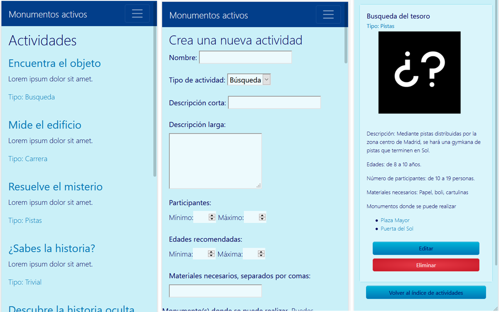
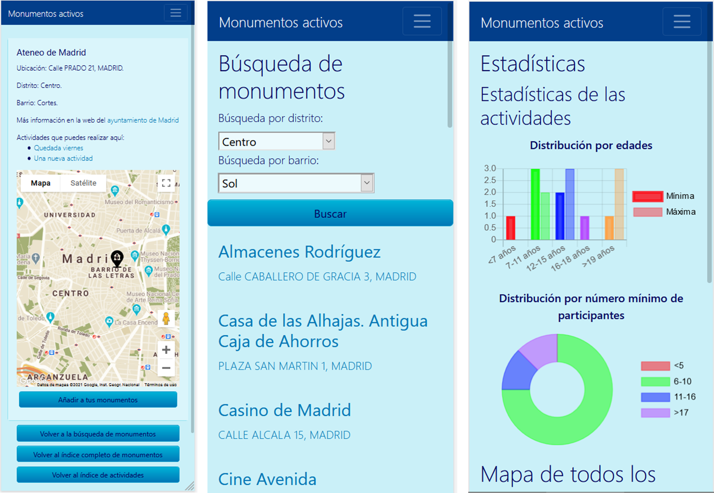

Este es el segundo proyecto del Bootcamp de Iron Hack. Inicialmente diseñada como un proyecto de dos personas, tuve que desarrollarla en solitario debido a problemas personales de mi compañero. Este proyecto tenía una serie de requisitos, como el uso de una API externa y el probar nuestras habilidades en back-end al tiempo que continuábamos aplicando nuestras habilidades en el front-end.

Con este (y otros requisitos, como rutas protegidas), busqué en la base de datos de APIs abiertas del gobierno de España y descubrí las bases de datos del Ayuntamiento de Madrid. Los datos de los monumentos me recordaron a cuando era monitora en un Grupo Scout en mi ciudad natal en Alcalá de Henares. La ciudad tiene una serie importante de lugares históricos que se podrían visitar. Por este motivo decidí mezclar ambas ideas en una app para móviles que te indicara que sitios visitar y que actividades podrías realizar allí. Cada actividad tendría información del número de participantes, materiales, edades recomendades y tipo de actividad. Con todo esto, empecé el desarrollo de Monumentos activos

*Diversas pantallas relativas a las actividades.*

El esquema de colores para la web se escogió usando [coolors.co](coolors.co/). Escogimos azul como color base y una combinación que sirviera para la gente que no usa modo oscuro en las webs, evitando contrastes muy fuertes entre un fondo oscuro con letras claras y viceversa. La ventaka de la web de coolors es que permite comprobar que los colores ofrecen contraste para la gente con daltonismo de cualquier tipo pueda verla sin problemas. Toda la app se diseñó en español y no en inglés, ya que los usuarios pueden ser personas que no tengan dominio del inglés. 

El principal problema con el desarrollo de la app fueron los datos de los monumentos. Al cogerlos, pensé que los datos eran una *rest API*, pero resultó ser un archivo json. La solución fue usar ese archivo como un elemento más de la base de datos, adaptándolo a las necesidades de la app. Como se nos exigía el uso de una API, me decanté por Google Maps, ya que los datos que ofrecía el Ayuntamiento tenían geolocalización y quedarían bien integrados con la app, e incluso podrían servir para desarrollar gymkanas de pistas a través de los distinto monumentos usando la geolocalización.

Respecto al back-end, se usaron tres colecciones: monumentos, actividades y usarios. Esta última es por el requisito de uso de rutas protegidas, que sólo permiten al usuario crear y editar sus propias actividades. Las colecciones de usuarios y actividades son las que contienen la información, siendo la monumentos de lectura, aunque cada monumento tiene su propia ficha con información de localización, su ubicación y otros detalles. Como curiosidad, se añadió una página de estadísticas para ver como es la distribución de actividades según el número de participantes y su edad, para valorar que actividades añadir o si son útiles las que hay para un grupo determinado.

*Pantallas para los monumentos, con un filtro por barrio y distrito, y la página de estadísticas.*

En la parte de front-end, se usó bootstrap para facilitar la labor de diseño en front-end, aunque algunos elementos se personalizaron. El diseño está pensado para usar en móviles aunque la app se puede usar en versión web también. Para renderizar las páginas se usó handlebars con layout. Se puede consultar la app en [heroku](https://monumentos-activos.herokuapp.com/) y visitar el repositorio en mi [github](https://github.com/Amanda-OC8/APP-Monuments)

###### Tecnologías: Bootstrap, CSS3, MongoDB, Handlebars, Node.js, API