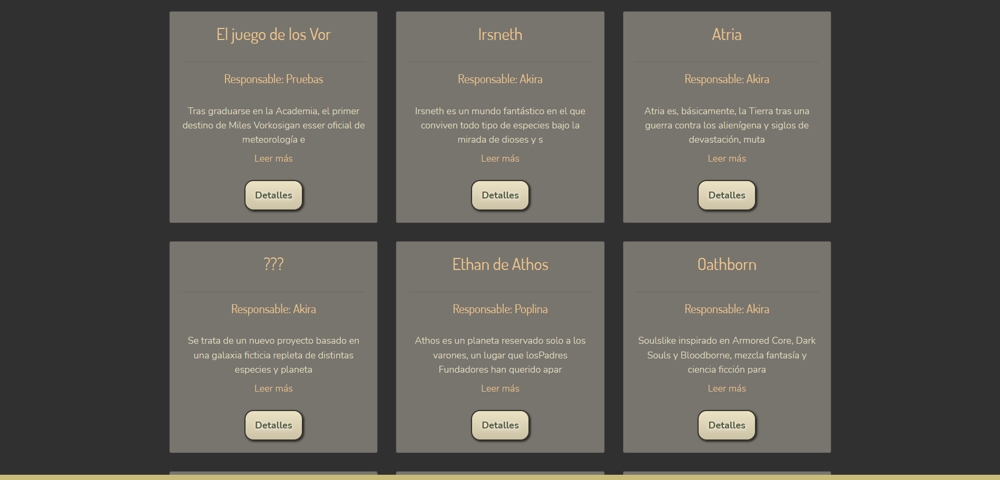

*Kraken's World Studio* was the third and final project at the Iron Hack Bootcamp. I team up with Aitor Martínez and Sergio Baltanás to develop a Single Page Application to create and manage different types od stories. The idea behind the project is centered the story's creation on a same place. We design a general case for many types of story, considering that all of them always have a story, characters and related work (as where the story takes place).

In this project I developed the back-end but some sections of the front-end was made together. One of them was choosing the color scheme. We choose a scheme based on gold and nearly black colors to develop a dark mode without big contrast and suitable for colour blind people. 

About the back-end, this project has four interconnected collections. The most complex part was managing the endpoints: each project has inside characters and folder. And inside the folders exist on archives. To access them, the app first calls the projects and folders, so care had to be taken in the endpoints so as not to hinder the hierarchy.

*Component tree on the right.*

Other complex element was developed the component tree of each project, to show each element on their project and their parent folder. This component tree exists in every project and allows to manage this content (only to the creator). You can Update, Delete and Create in the own project view. In the case of the story and the archive, a CMS was implemented on the project to create easier a formatted text for the story.

The model for the projects was made  with many different types of projects on mind. We considered the creation of role campaigns, long stories, short stories, comic's scripts, video games' scripts... We also had in consideration that a project maybe has multiple genres and for this reason the author indicates the main genre and add taglines to specific the others elements. These tag are based on [AO3](https://archiveofourown.org/) tag system and the idea is that the users can filter using the tags (and the genre, type of project...)

As other projects, we work using react-bootstrap as base for the dimensions but modifying some elements, like the buttons and design the app for web use. We thought on some scalability features that we couldn't implement for the lack of time. One of them was adding a bright mode. Other was a more complex search filter, to search using various options. Other feature was a better public-private part management. Each project can be made public or private, all the project or some of their parts. We wanted that this could have different levels of visibility. For example, on a role campaign, the map can be seen for everyone, but only the players can view the character sheet, and only the own player can view some story's parts. Other idea was to make the page multilingual, on Spanish and English, but we din't have enough time for this.

*View of some of the projects.*

Some of the difficult with the project was that we didn't work using hooks. We managed the different components using the life-cycle component, and we had difficult on the most complex parts, as the call of all the component tree and the project. Also, we found problems on the calls of the collections from the back-end for the hierarchy of the calls to the archives.

In this project we had more time than the previous, and for this reason we had to manage them arefully to avoid a burnout the last days (the most criticals). The experience was challenging and complex but with a good team work we can success thanks the effort and support of the team. We divided the work and worked on line to resolve errors and avoid development's blocks. I'm very proud and happy od the work and the experience with my mates to develop out first SPA. The final result can check on [git-hub](https://github.com/Amanda-OC8/kraken2).

###### Technologies: CSS3, Node.js, React, MongoDB, React-Bootstrap, Express
