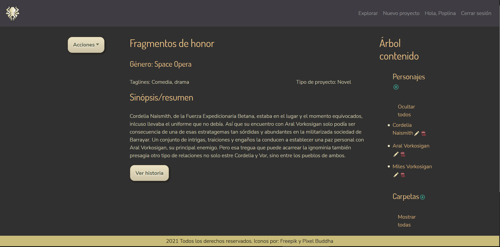

*Kraken's World Studio* was the third and final project at the Iron Hack Bootcamp. I manage team with Aitor Martínez and Sergio Baltanás to create a SPA to create and manage different types od stories. The idea is centered the story's creation on a same place. We design a general case for all type of story, considering that all of them always have a story, characters and related work (worldbuilding). The idea is that the story (named as projects) and their related files can be public or not to other creators. We worked with a limited palette of colors, based on gold and nearly-black colors.

In this project, I developed the back-end, with four principal collections interconnected. The most complex was manage the endpoints: The project has inside characters and folders. And inside the folders, exist archives. The access the last of them was the most complex, on the back-end, but also on the front-end, because the archive needs the story and the folder information to get access. Althought this is a bit complex, allow to know on every momento where is the user.

Other complex element was developed the tree content of each project, to show each element to their project and their parent folder. This tree content exists in every project and allow to manage this content (only if you are the creator). You can Update, Delete and Create in the own project view. In the case of the story and the archive, a CMS was implemented on the project to create fomatted text for the story.

The model for the projects were made thinking on the most diverse type of projects. We considered the creation of role campaigns, long stories, short stories, comic's scripts, video games' scripts... We also had in consideration that a project maybe have multiple genre and for this reason the athour indicates the main genre and add taglines to specificy the others elements. These taglines are based on [AO3](https://archiveofourown.org/) tag system and the idea is that the users can filter using the tags (and the genre, type of project...)

###### Technologies: CSS3, Node.js, React, MongoDB, React-Bootstrap, Express
